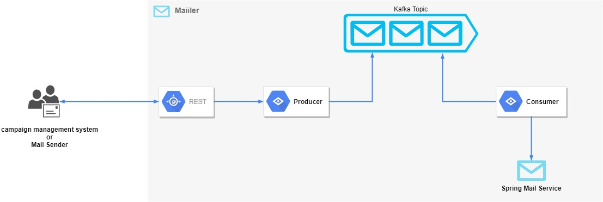

# Mailer
Mailer is a Micro Service responsible of Asynchronous sending of Emails

## Description
This code base provides a micro service capable of sending mails asynchronously. It has been developed using spring boot framework and uses Apache Kafka for messaging.

To make sure things are not over engineered, for starters it uses single consumer and single producer to take care of mail requests.  

## Requirement
- REST API with synchronous acknowledgment with only one method for sending new Mail
- Mail with attachment should be possible. (Attachment Content will be provided in the request by a URI pointing to the actual document binaries)
- Queuing until successful response from SMTP Server. Max Retry configurable.
- No Authentication required.

## Tools used
- **Spring boot** framework used to write microservice
- **Kafka** for messaging
- **Spring Retry** to automatically retry a failed operation  
- **Embedded kafka** for testing
- **Junit 4** for unit tests
- **Swagger** for API documentation
- **Maven** for build
- **google guava** for commons library
- **Spring mail** to send mail
- **Mockito** for unit tests mock
- **HttpURLConnection** used to download attachment binaries

# Architecture

# Scalability
- Scalability aspect has been covered since this microservice can scale vertically or horizontally by either spin off more instances with load balancer or introduce more consumers which deal with mail sending asynchronously.

# Future Suggestions
-

## Assumptions
- If a mail failed after n(configurable in application.properties) retries, its considered a failure.
- Attachment can either be an direct url(https://google.com/robots.txt) or a generic one(https://drive.google.com/uc?id=1OjVXW2xK9eHcBAjJJygtcyYtiQBwX-tt&export=download)
- If attachment URI is a direct url, file name will be received from url itself
- If attachment URI is a generic one, file name will be received from content-disposition header.
- If attachment fetching failed,  
- Failed records/attempts are need not be persisted in any form inside the application
-
